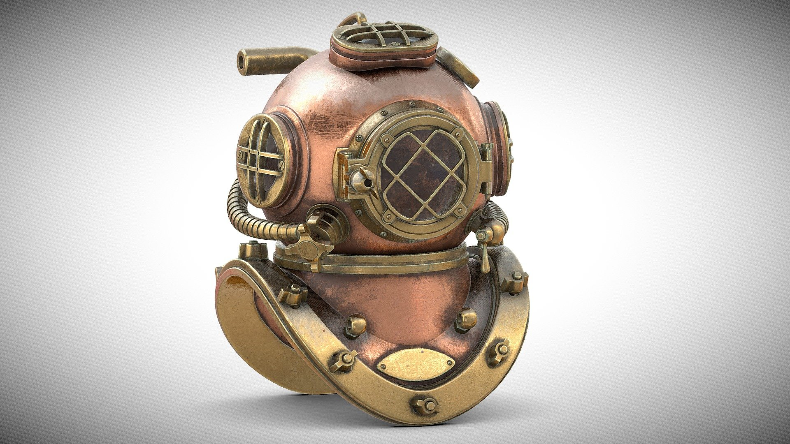
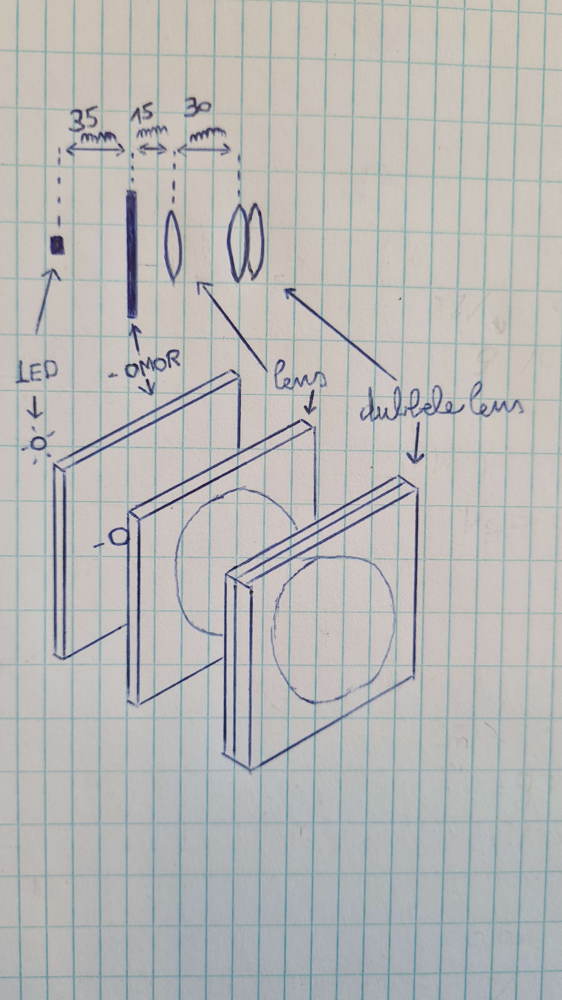
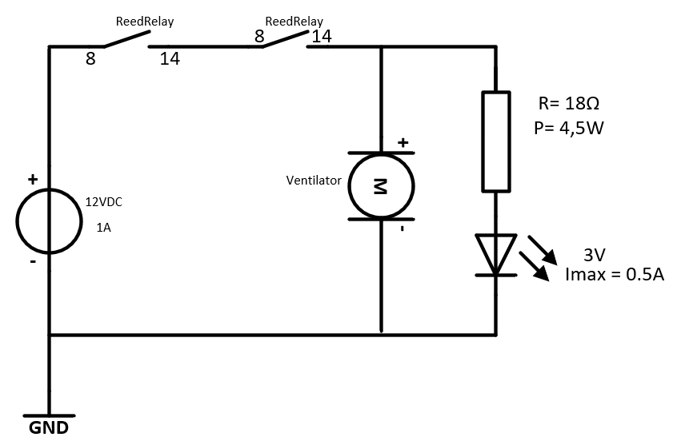
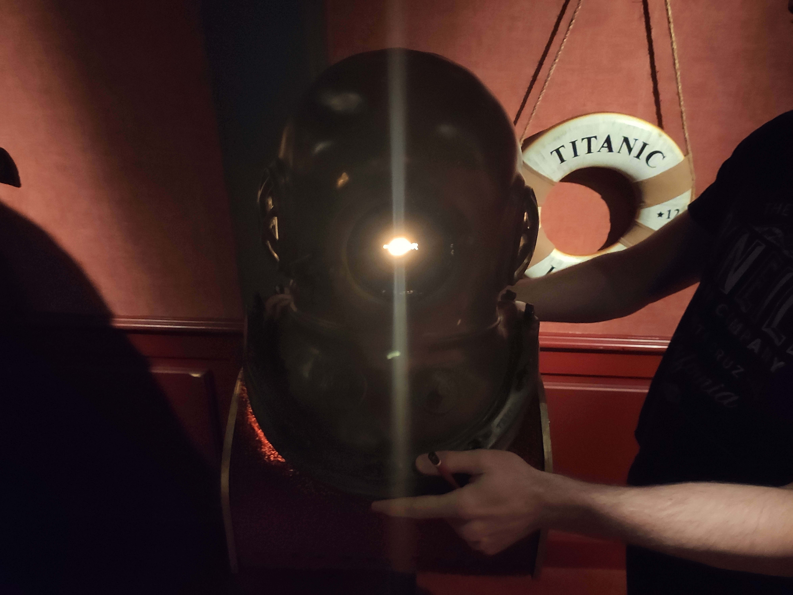
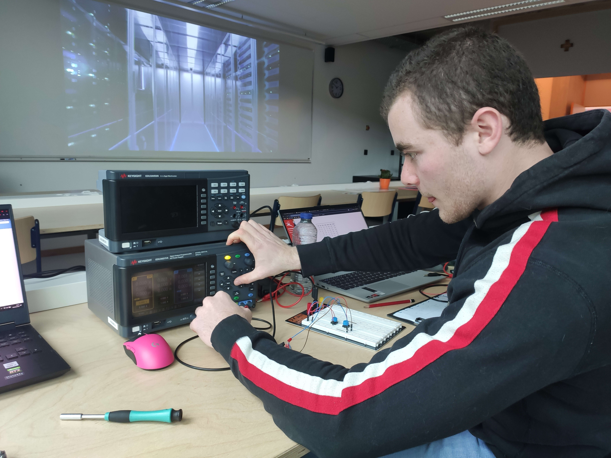
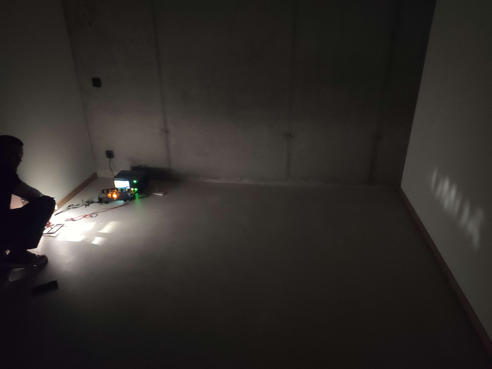
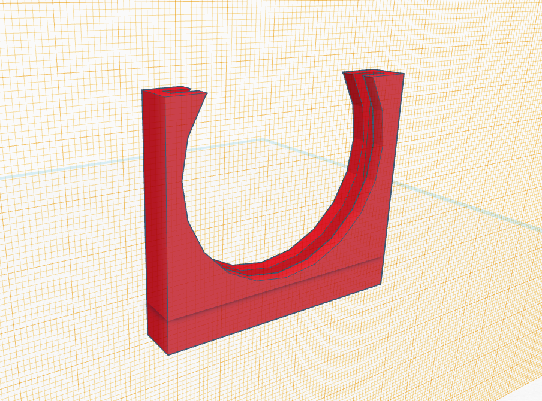
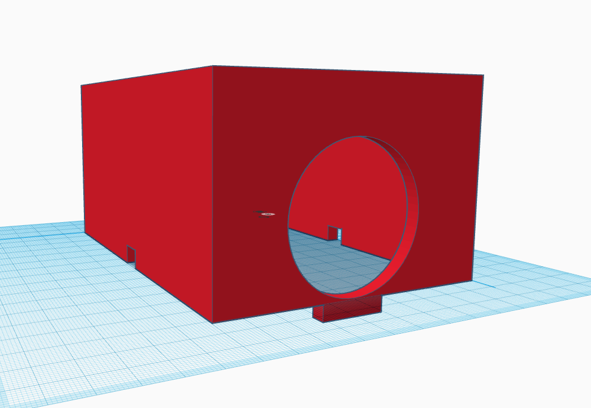
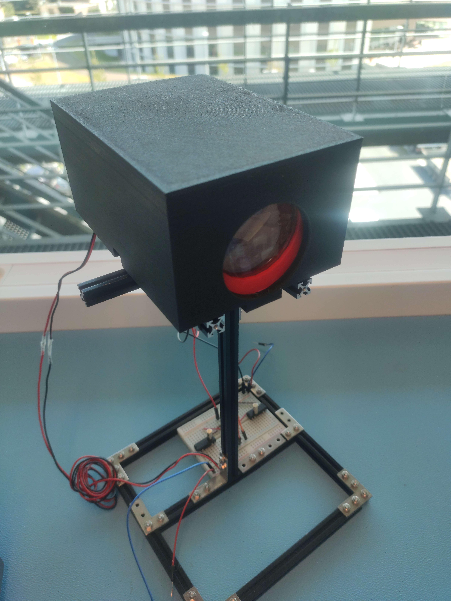
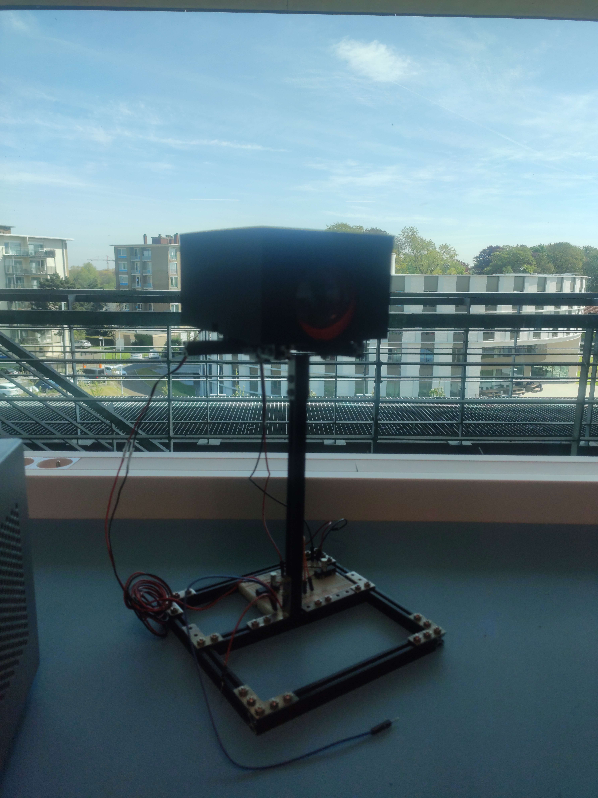

# Diving-Helmet"
 
<h1> What our project does </h1>
 
 

 
 

    <h3>
        <b>Beschrijving:</b>
         
         
         
         
        Ons project is ook een soort van add-on voor escape-room 'The Push' in Dudzele. 
        De spelers vinden een oude duikershelm en moeten deze in een andere ruimte op een statief zetten.  
        Door middel van projectie kunnen we vervolgens letters projecteren op het grote doek.  
        Die letters hebben de spelers nodig om verder te gaan in de escape-room.  
         
         
         
         
         
         
        <b>Ons project werkt als volgt: </b>
         
        <ul>
            <li>Een systeem bedenken die kan herkennen of de helm juist gepositioneerd staat, dus met de voorkant richting het projectiescherm</li>
            <li>Een systeem bedenken om de letters te projecteren op het scherm</li>
        </ul>
         
         
         
         
         
    <h1>Calendar &#x1F4C5;</h1>
         
         
         
        <b>-FEBRUARI 2023-</b>
         
         
         
         
        Op deze dag zaten wij (het team) samen te denken hoe we dit gingen aanpakken. A.d.h.v. een planning hadden we meer structuur over ons project, hoe we dit project gaan aanpakken, bepaalde deadlines op bepaalde dagen die we willen behalen (zoals onze eerste prototype finaliseren, masker), enz... . We hebben ook gekeken welke materialen zoals leds, sensoren, enz... we nodig hadden om aan ons project te kunnen voldoen, na veel opzoek werk op de computer hebben uiteindelijk de nodige materialen gevonden. Onze collega Jef heeft ook een tekening gemaakt van een elektrisch schema die we nodig hebben voor ons project.
         
         
         
         
         
         
         
         
        <b>-MAART 2023-</b>
         
         
         
         
        Op 02/03/2023 begonnen we met het ontwerpen van het concept en het elektrotechnisch circuit voor ons project, waarbij we rekening hielden met de afmetingen van de duikershelm. We hebben ook een briefing gehad met onze docenten om onze ideeën en plannen te bespreken.
         
         
         
         
         
         
        Op 04/03/2023 werkten we buiten de projecturen aan het ontwerp van een didactisch voorbeeld en een statief waarop het circuit, de LED, enzovoort konden worden geplaatst.
         
         
         
         
         
         
        Op 09/03/2023 hebben we een bestellijst samengesteld met alle benodigdheden voor ons project, waaronder drie Hall-sensoren, een lens voor de LED, een LED-lamp en een transistor. We hebben ook gewerkt aan het ontwerp van de letters met behulp van een softwaretool genaamd Autocat.
         
         
         
         
         
         
        Op 16/03/2023 zijn we begonnen met het in elkaar zetten van het ontwerp, maar we konden het niet voltooien vanwege de late levering van de benodigdheden en de vertraging in de levering van de letters. Daarom hebben we ons gericht op het verder uitwerken van ons plan.
        transistor. We hebben ook gewerkt aan het ontwerp van de letters met behulp van een softwaretool genaamd Autocat.
         
         
         
         
         
         
        Op 23/03/2023 zijn enkele van de materialen uit onze boodschappenlijst aangekomen, waaronder de LED, transistor, sensor en letters, maar de lens was nog steeds niet geleverd. Dit heeft ons in een lastige situatie gebracht omdat we niet konden bepalen hoe ver de lens en de LED van elkaar zouden moeten liggen zonder de lens. We hebben het prototype dat we hadden getest in een pikdonkere kamer en tot onze verbazing lukte het ons toch om de letters te projecteren op de muur. De afstand tot die muur was relatief dezelfde als in de escape-room. Met lenzen kunnen we zeker 
         
         
         
         
         
         
        En nu, op 30/03/2023, zitten we nog steeds vast in ons project vanwege het feit dat de lens nog steeds niet is aangekomen. We blijven geduldig wachten op de levering zodat we verder kunnen gaan met ons ontwerp. Dit is een goed voorbeeld van hoe projecten kunnen worden beïnvloed door externe factoren die buiten onze controle liggen en hoe belangrijk het is om flexibel te blijven en oplossingen te vinden voor onverwachte uitdagingen.
         
         
         
         
         
         
        <b>-MEI 2023-</b>
          
        *
         
        *
         
        *
         
        *
         
        *
         
        Tot op vandaag (04/05) hebben gekeken voor het design van ons project. Ook hebben we lenzen aangeschaft die we dan getest hebben in de donkere kamer. We zijn ook veel bezig geweest met het desingnen van 3d-modellen om ons project wat professioneler te laten overkomen.
         
    <h1>How to install it</h1>
         
         
         
        Plaats de magneetsensoren in de helmhouder. Verbind ze volgens het schema in bijlage. Plaats de staaf waar de opstelling op gemonteerd is op dezelfde hoogte als het vizier van de helm.
         
         
         
    <h1>Example usage</h1>
    <h1>How to set up the dev environment</h1>
    <h1>How to ship a change</h1>
    <h1>Change log</h1>
    <h1>Used programs</h1>
         
        <ul>
            <li>Autocad</li>
            <li>Eagle</li>
            <li>Tinckercad</li>
        </ul>
    <h1>Onderdelen</h1>
     
     
     
    <ul>
        <li><b>lens : </b>https://www.kabelshop.nl/Toolland-Lens-voor-loeplamp-Toolland-3-dioptrie-O-10-cm-VTLLAMPXX-3DL-i18553-t245755.html?gclid=Cj0KCQiAxbefBhDfARIsAL4XLRoZfJOQI-1zdj85nWLnMs0SBbc_1uflFTE0JevNpZqviNM2cknX7XEaAo79EALw_wcB </li>
        <li><b>LED : </b>https://be.farnell.com/cree/xpgbwt-he-0000-00je5/led-hb-4000k-neutral-white-148lm/dp/3050617 </li>
        <li><b>Makerbeam</b></li>
        <li><b>Reed-relais</b></li>
        <li><b>weerstand (1 Ohm)</b></li>
        <li><b>Breadboard</b></li>
        <li><b>3d-prints</b></li>
    </ul>
      
     
     
    <h1>Plan met onderdelen</h1>
         
         
         
         
    <h1>Electric Circuit</h1>
         
    <h1>Photos &#x1F4F7;</h1>
         
         
        <b>HELM IN ESCAPE-ROOM</b>
         
         
         
         
        <b>OPENDEURDAG MAART</b>
         
         
         
         
        <b>TEST PROTOTYPE IN DONKERE KAMER</b>
         
         
         
         
         
         
         
         
         
         
         
         
         
        <b>PROJECT OP 04/05</b>
          
         
         
         
         
         
         
         
         
         
         
         
         
    <h1>Contact and participators &#9742;</h1>
         
        Main author: Milan Verleye, student @ VIVES Brugge
         
        E-mail: milan.verleye@student.vives.be
         
         
         
         
        <b>Jef Pichal</b>
         
         
        <b>William Rogov</b>
         
         
        <b>Richard Rogov</b>
         
         
        <b>Milan Verleye</b>
    </h3>

